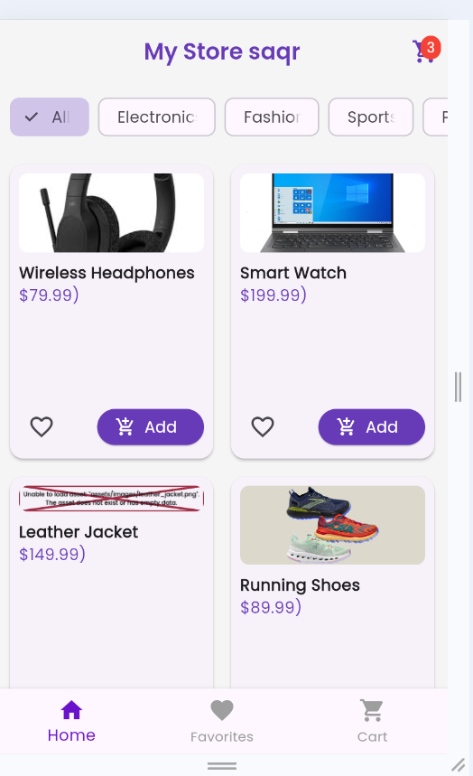
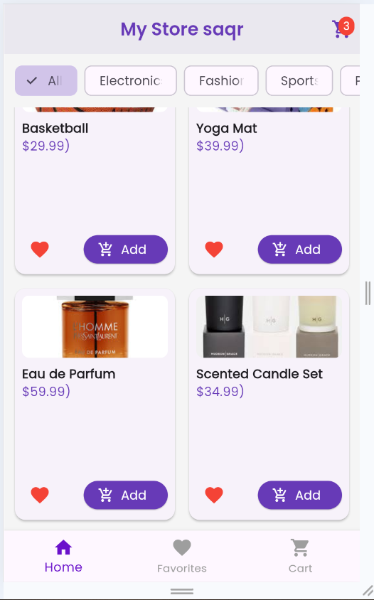
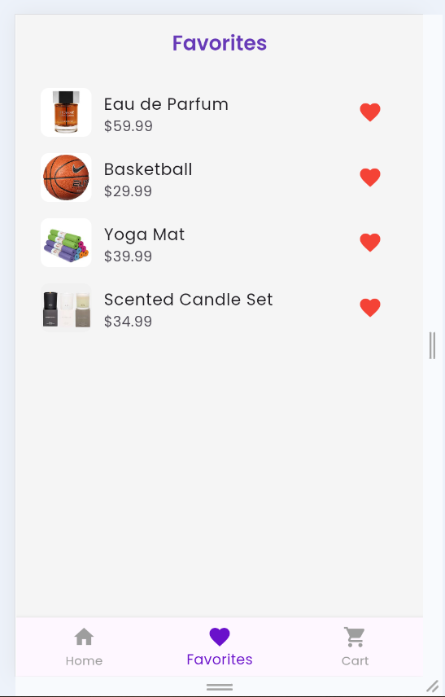
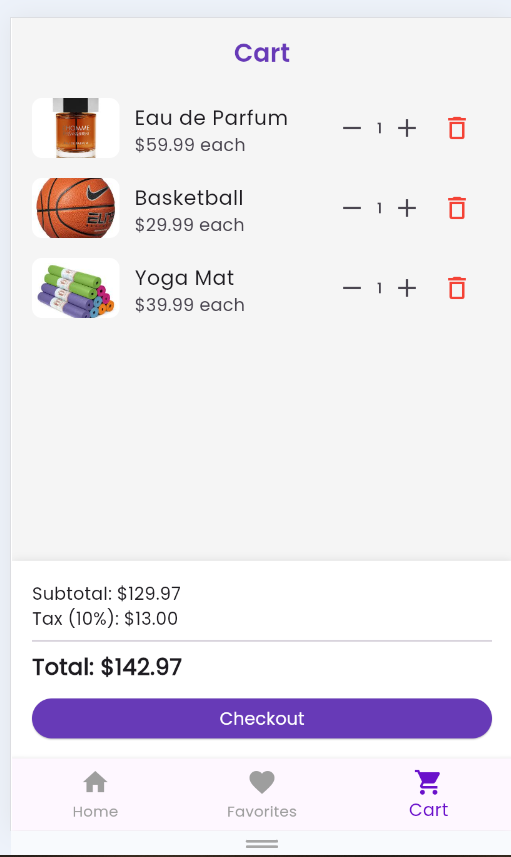
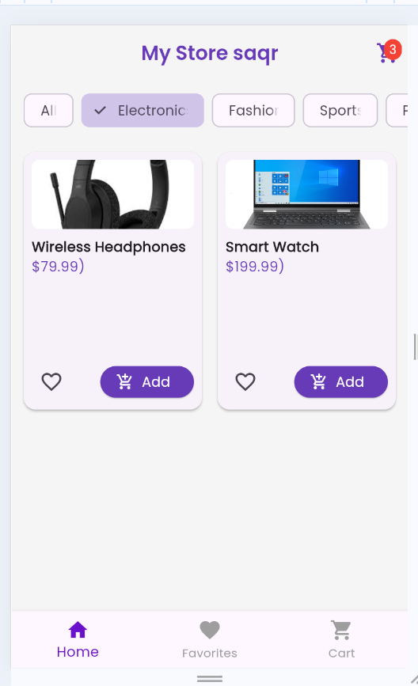

# 🛍️ E-Commerce App (Flutter + Provider + API + Offline Support)

A multi-screen e-commerce application built with **Flutter** using **Provider** for state management, featuring real integration with an external API and full offline support.

This project demonstrates professional best practices for separating UI from business logic, handling errors cleanly, and optimizing performance using different Provider techniques such as `Consumer`, `Selector`, and `listen: false`.

---

# 🧱 Architecture

The application follows a simplified **MVVM architecture** using `ChangeNotifier` as ViewModels and `Provider` for connecting state to the widget tree.

```text
[UI Layer]  ←→  [Providers (ChangeNotifier)]  ←→  [Services (API/Local Storage)]
     ↑                      ↑
  (Widgets)         (State + Business Logic)
```

* **UI Layer:** Screens and widgets listening to state changes using `Consumer` and `Selector`.
* **Providers Layer:** Manages application state (products, favorites, cart) and business logic.
* **Services Layer:** Wraps HTTP communication (`BaseApiService`, `ProductService`, `CartService`) and local storage access (`LocalStorage`).

---

# 🔄 Key Changes Between the Initial and Current Version

| Area                | Initial Version              | Current Advanced Version                                 |
| ------------------- | ---------------------------- | -------------------------------------------------------- |
| **Data Source**     | Static mock data inside code | Real **FakeStore API** integration                       |
| **Storage**         | None                         | Local caching using **SharedPreferences**                |
| **Offline Support** | Not supported                | Loads cached data when offline                           |
| **Error Handling**  | No handling                  | Custom `ApiException`, translated errors, full try/catch |
| **Loading States**  | Direct rendering             | `LoadingState` with loading indicators and retry button  |
| **Favorites**       | Temporary in memory          | Persisted permanently using `SharedPreferences`          |
| **Cart**            | Local only                   | Local updates + silent API synchronization               |
| **Network Errors**  | Not handled                  | Timeout detection and `SocketException` handling         |
| **Permissions**     | Missing                      | Internet permissions for Android and macOS               |
| **Extra Features**  | None                         | Product details screen and cart badge counter            |

---

# 📁 Project Structure

```text
lib/
├── main.dart                           # Entry point, MultiProvider setup, bottom navigation
├── models/
│   ├── product.dart                    # Product model with fromJson/toJson
│   ├── cart_item_model.dart            # Local cart item model (Product + quantity)
│   └── cart_model.dart                 # API cart model (id, userId, date, products[])
├── services/
│   ├── base_api_service.dart           # Generic HTTP client (GET/POST/PUT/DELETE)
│   ├── product_service.dart            # fetchProducts() / fetchCategories()
│   ├── cart_service.dart               # fetchCart() / addToCart() / removeFromCart()
│   └── api_exception.dart              # Custom exception with statusCode and readable messages
├── helpers/
│   └── local_storage.dart              # Save/load product cache using SharedPreferences
├── providers/
│   ├── product_provider.dart           # Product loading, filtering, loading state
│   ├── favorites_provider.dart         # Favorites with automatic local persistence
│   └── cart_provider.dart              # Cart operations and API synchronization
├── screens/
│   ├── home_screen.dart                # Main screen with loading/error states
│   ├── favorites_screen.dart           # Favorites screen
│   ├── cart_screen.dart                # Cart screen with financial summary and Selector optimization
│   └── product_detail_screen.dart      # Full product details screen
├── widgets/
│   ├── product_card.dart               # Reusable product card
│   ├── cart_item_tile.dart             # Cart item row with quantity controls
│   └── error_widget.dart               # Reusable error widget with retry button
└── theme/
    └── app_theme.dart                  # Color palette, Poppins font, theme settings
```

---

# ⚙️ How It Works

## 1. API Communication (`BaseApiService`)

* The `baseUrl` (`https://fakestoreapi.com`) is defined once centrally.
* All requests pass through `_handleRequest`, which applies a 10-second timeout.
* HTTP headers are configured automatically:

  * `Content-Type: application/json; charset=UTF-8`
  * `Accept: application/json`
* Common HTTP errors (`400`, `404`, `500`, etc.) are converted into user-friendly messages.
* `SocketException` and `TimeoutException` are transformed into readable API exceptions such as:

  * `"No Internet Connection"`
  * `"Connection Timed Out"`

---

## 2. Product Loading (`ProductProvider`)

```text
initState() → loadProducts() → [Loading] → API call → Success → cacheLocal
                                     ↘ Failure → load from cache
```

* On startup, the provider enters the loading state and displays a loading indicator.
* On success, products are cached locally using `SharedPreferences`.
* On failure, cached data is loaded if available; otherwise, an error widget with a retry button is displayed.

---

## 3. Local Storage (`LocalStorage`)

* Product lists are converted to JSON using `toJson()` and stored in `SharedPreferences`.
* Restoration is done by decoding JSON and rebuilding objects using `Product.fromJson()`.
* Local caching is used only for products; favorites have separate persistence logic.

---

## 4. Persistent Favorites (`FavoritesProvider`)

* Favorites are saved immediately after each `toggleFavorite()` operation.
* The favorites list is restored automatically during provider initialization.
* Favorites work entirely offline.

---

## 5. Shopping Cart (`CartProvider`)

* Add/remove/update operations happen locally first for instant UI updates.
* Background synchronization with the API is attempted silently using `CartService`.
* Cart calculations (`subtotal`, `tax`, `total`) are computed dynamically.
* The UI listens selectively using `Selector` to reduce unnecessary rebuilds.

---

## 6. Performance Optimization

* `Consumer` is scoped to the smallest possible widgets (e.g., favorite icon, cart summary).
* `Selector` is used to monitor only the `total` value inside the cart screen.
* `Provider.of<T>(context, listen: false)` is used inside callbacks to avoid rebuilds.
* `const` constructors are applied wherever possible.

---

# 🚀 Getting Started

## Requirements

* Flutter SDK ≥ 3.0
* VS Code or Android Studio
* Browser, emulator, or physical device

---

## Installation & Run

```bash
# Clone repository
git clone https://github.com/saqrsaad/E-Commerce-App.git

# Open project
cd ecommerce-app

# Install dependencies
flutter pub get

# Run on Chrome
flutter run -d chrome

# Or run on a connected device
flutter run
```

---

## Internet Permissions

### Android

Ensure the following permission exists inside:

```text
android/app/src/main/AndroidManifest.xml
```

```xml
<uses-permission android:name="android.permission.INTERNET"/>
```

### macOS

Ensure the following entitlement is enabled:

```text
macos/Runner/*.entitlements
```

```xml
com.apple.security.network.client = true
```

---

# 🌐 Web Deployment

## Netlify

```bash
flutter build web
```

Upload the `build/web` folder to:

[Netlify](https://netlify.com)

---

## Firebase Hosting

```bash
npm install -g firebase-tools

firebase login

firebase init hosting
# Select:
# public directory = build/web

firebase deploy --only hosting
```

Official website:

[Firebase Hosting](https://firebase.google.com)

---

# 🧪 Testing Scenarios

### Offline Mode

When the app starts without internet:

* Cached products are displayed if available.
* Otherwise, a `"No Internet Connection"` message appears.

### Connection Timeout

Reducing the timeout duration to 2 seconds inside `BaseApiService` triggers:

* `"Connection Timed Out"`

### Missing Product

Calling:

```http
GET /products/9999
```

Returns:

* `"Data Not Found"`

### Cart Operations

* Cart badge updates instantly.
* Products appear immediately after adding.

### Favorites Persistence

* Favorites remain saved after restarting the app.

---

### 📸 Screenshots

```html
<p align="center">
  
  
  
  
  
  
  
  
</p>
```

---

# 🧰 Technologies Used

* **Flutter** (Stable Channel)
* **Provider** ^6.1.2
* **http** ^1.2.0
* **shared_preferences** ^2.2.2
* **google_fonts** ^6.2.1
* **FakeStore API**

Official API website:

[FakeStore API](https://fakestoreapi.com)

---

# 📄 License

MIT License — Free to use, modify, and distribute with attribution.

---

# ✍️ Developer Notes

* This project started as an academic assignment and was later expanded with real API integration and offline support.
* It demonstrates how to migrate from mock data to real backend data without breaking application architecture.
* The project can easily switch from FakeStore API to any other backend by updating:

  * `baseUrl`
  * `fromJson()`
  * `toJson()` models
