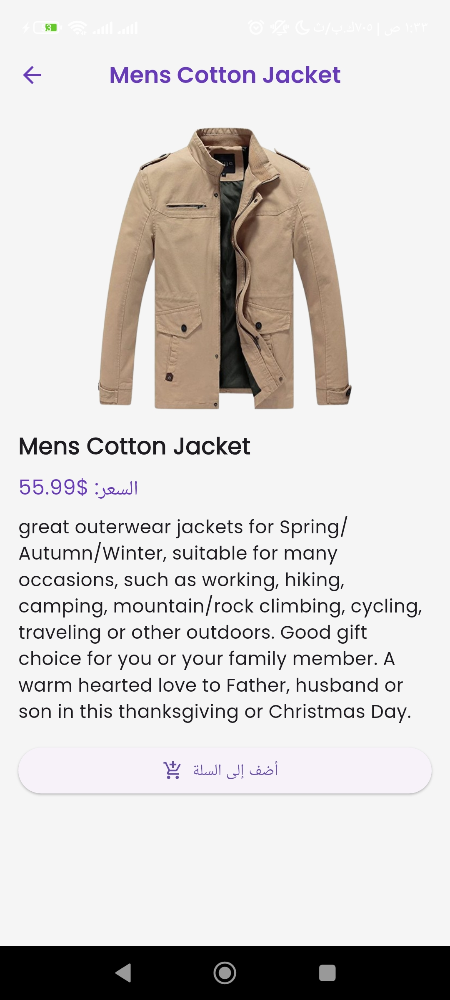
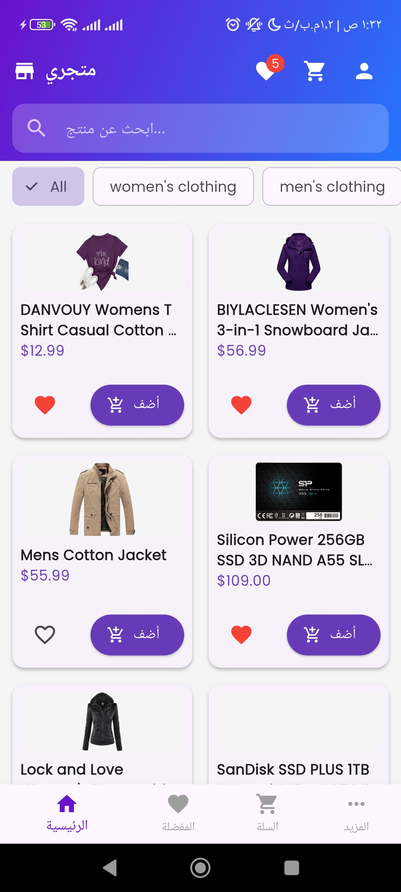
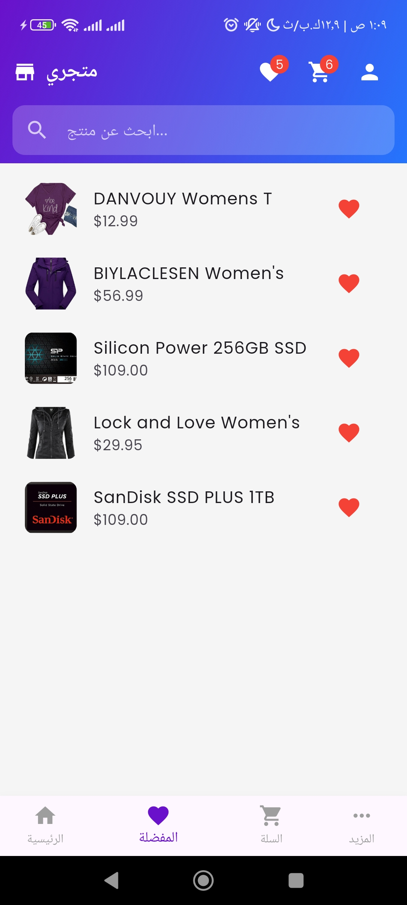
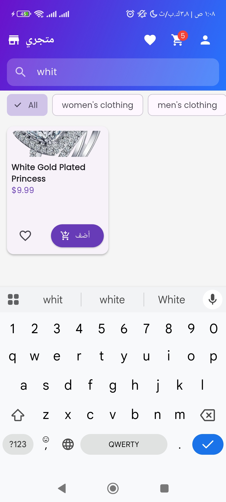

# 📘 Comprehensive Engineering Documentation — E-Commerce Application (Firebase Migration)

This document provides a complete overview of the engineering changes implemented during the migration of the E-Commerce application from a mock REST API architecture to a modern backend powered by Firebase. The migration focused on improving scalability, maintainability, real-time synchronization, and user experience while preserving a clean and modular software architecture.

---

# 🎯 Project Objective

The primary objective of this migration was to replace the previous mock-data implementation and FakeStore REST API integration with a production-ready backend based on **Firebase Authentication** and **Cloud Firestore**.

The migration also aimed to:

* Maintain a clear separation between presentation, business logic, and data layers.
* Improve application scalability and maintainability.
* Introduce real-time synchronization for products and user favorites.
* Enhance the user experience through seamless authentication flows and contextual dialogs.
* Provide a secure and extensible backend architecture for future development.

---
# 📸 Screenshots

```html
<p align="center">
  
  
  
  
  
  
  
  
   
    
     

</p>
```
---
# 📐 Software Architecture

The application follows a simplified **MVVM (Model–View–ViewModel)** architecture using `Provider` and `ChangeNotifier` for state management.

## Current Architecture Structure

```text
[UI Layer (Screens / Widgets)]
          ↓
   Consumer / Selector
          ↓
[Providers (ChangeNotifier)]
          ↓
        Services
(FirebaseAuth / Firestore)
          ↓
   Firebase Backend
```

## Architectural Responsibilities

### UI Layer

Responsible for rendering data and handling user interactions.

* Uses `Consumer` and `Selector` for efficient widget rebuilding.
* Contains no direct Firebase logic.
* Delegates all business logic to Providers.

### Provider Layer

Acts as the ViewModel layer.

* Manages application state.
* Coordinates between UI and Services.
* Handles loading states, caching, filtering, and error management.
* Notifies listeners only when required.

### Service Layer

Encapsulates all Firebase operations.

* Completely independent from Flutter UI.
* Contains reusable authentication and Firestore logic.
* Enables easier testing and future backend replacement.

---

# 🔐 Firebase Initialization & Authentication

## Overview

Firebase Authentication was integrated to provide secure user login and registration using email and password authentication.

The authentication system includes:

* Firebase SDK initialization
* Authentication state management
* Login and registration UI
* Error translation to Arabic messages
* Automatic session handling

---

## Added Files

| File                               | Responsibility                                                                                                             |
| ---------------------------------- | -------------------------------------------------------------------------------------------------------------------------- |
| `lib/services/auth_service.dart`   | Encapsulates all Firebase Authentication operations and translates Firebase exceptions into user-friendly Arabic messages. |
| `lib/providers/auth_provider.dart` | Handles authentication state and exposes login, registration, and logout methods.                                          |
| `lib/screens/auth_screen.dart`     | Complete authentication UI with form validation and responsive design.                                                     |
| `lib/firebase_options.dart`        | Auto-generated Firebase platform configuration file created using `flutterfire configure`.                                 |

---

## Updated Files

### `pubspec.yaml`

Added Firebase dependencies:

```yaml
firebase_core
firebase_auth
cloud_firestore
```

### `lib/main.dart`

Updated to:

* Initialize Firebase asynchronously using `Firebase.initializeApp()`
* Register `AuthProvider` using `MultiProvider`
* Introduce `AuthGate` to monitor authentication state changes

---

## Engineering Decisions

### Service Isolation

`AuthService` was intentionally designed without any dependency on Flutter UI or `BuildContext`.
This ensures:

* Better testability
* Reusability
* Cleaner separation of concerns

### Centralized Authentication State

`AuthProvider` internally listens to:

```dart
authStateChanges()
```

This allows automatic UI updates whenever authentication state changes.

### Incremental Migration Strategy

Existing providers such as:

* `CartProvider`
* `ProductProvider`

were intentionally kept independent from authentication during the first migration stage to avoid unnecessary regressions.

---

# 🗄 Firestore Data Architecture & Seeding

## Overview

Cloud Firestore replaced the previous external API and became the primary application database.

The implementation included:

* Firestore collection design
* Security rules
* Seed services
* Real-time product synchronization

---

## Firestore Collections Structure

```text
products
├── {productId}
│   ├── title
│   ├── description
│   ├── price
│   ├── imageUrl
│   ├── category
│   ├── rating
│   ├── ratingCount
│   ├── stock
│   ├── isFeatured
│   ├── searchKeywords[]
│   └── createdAt

users
└── {userId}
    ├── name
    ├── email
    ├── phone
    ├── favorites
    ├── orders
    └── addresses

siteContent
├── about
├── privacy
├── terms
├── contact
└── sellWithUs
```

---

## Added Files

| File                             | Responsibility                                                                         |
| -------------------------------- | -------------------------------------------------------------------------------------- |
| `firestore.rules`                | Firestore security rules for protecting user data and restricting unauthorized writes. |
| `lib/services/seed_service.dart` | Handles initial database population and content seeding.                               |

---

## Updated Files

### `lib/models/product.dart`

Enhanced with:

* `Product.fromFirestore()`
* `toMap()`
* Additional metadata fields

Example added fields:

```dart
searchKeywords
stock
ratingCount
isFeatured
```

### `lib/services/firestore_service.dart`

Introduced core Firestore operations:

* `getProductsStream()`
* `searchProducts()`
* `getCategories()`

### `lib/main.dart`

Added initial seed execution after Firebase initialization:

```dart
SeedService().runAllSeeds();
```

---

## Internal Implementation Details

### Seed Protection

Before inserting data, the seed service verifies whether the collection already contains documents to prevent duplicate insertion.

### Search Optimization

Product titles are tokenized into keywords and stored in:

```dart
searchKeywords
```

This enables efficient client-side search functionality.

### Security Rules

Firestore rules were configured to:

* Allow public read access to products and static content
* Completely block client-side product writes
* Restrict user data access using:

```javascript
request.auth.uid
```

---

# 🔎 Product Management & Real-Time Search

## Overview

The product system was migrated from REST API requests to Firestore streams.

The new implementation provides:

* Real-time product updates
* Local search filtering
* Debounced search input
* Centralized product state management

---

## Core Refactor

### `lib/providers/product_provider.dart`

Completely rewritten to:

* Subscribe to Firestore streams using `StreamSubscription`
* Cache all products locally
* Automatically synchronize UI with Firestore changes
* Support local filtering and retry handling

---

## Search Implementation

Search functionality was designed using:

* Local filtering
* Debounce delay (`300ms`)
* Cached product collections

This approach minimizes unnecessary Firestore reads and improves responsiveness.

---

## Performance Considerations

### Optimized Rebuilds

The UI avoids direct use of large `StreamBuilder` trees.

Instead:

* Firestore updates are processed inside Providers
* UI rebuilds are triggered selectively using `notifyListeners()`

### Instant Filtering

Filtering occurs locally through:

```dart
filteredProducts
```

which provides near-instant search feedback.

---

# ❤️ Favorites System with Firestore

## Overview

Favorites were migrated from local storage (`SharedPreferences`) to Firestore.

Each authenticated user now owns a personal favorites collection:

```text
users/{userId}/favorites
```

---

## Added File

| File                                  | Responsibility                                                       |
| ------------------------------------- | -------------------------------------------------------------------- |
| `lib/services/favorites_service.dart` | Handles Firestore favorite operations and real-time synchronization. |

---

## Major Refactors

### `favorites_provider.dart`

Refactored to:

* Depend on `AuthProvider`
* Automatically react to authentication changes
* Start or stop Firestore listeners dynamically
* Expose authentication-aware UI state

### Dependency Injection

`ChangeNotifierProxyProvider` was introduced to inject authentication dependencies into the favorites provider.

---

## Smart Authentication Flow

When unauthenticated users attempt to favorite a product:

1. A login dialog appears
2. Authentication occurs without page navigation
3. The original action resumes automatically after successful login

This significantly improves user experience by preserving interaction context.

---

# 🧩 Shared Layout & Static Content Pages

## Overview

The application layout was unified through reusable shared components:

* `AppHeader`
* `AppFooter`

Additional static pages were also introduced using Firestore-powered content.

---

## Added Components

| File                          | Responsibility                                                                         |
| ----------------------------- | -------------------------------------------------------------------------------------- |
| `lib/widgets/app_header.dart` | Shared application header with search, navigation, cart, favorites, and user controls. |
| `lib/widgets/app_footer.dart` | Shared footer with navigation links and informational sections.                        |

---

## Added Static Pages

| File                       | Purpose                 |
| -------------------------- | ----------------------- |
| `about_screen.dart`        | About page              |
| `privacy_screen.dart`      | Privacy policy          |
| `terms_screen.dart`        | Terms and conditions    |
| `contact_screen.dart`      | Contact page            |
| `sell_with_us_screen.dart` | Seller information page |

---

## Static Content Loading

Static pages use:

```dart
FutureBuilder
```

to load content from Firestore dynamically.

Fallback local content is displayed if Firestore content is unavailable.

---

# 💬 Login Dialog & UX Improvements

## Overview

A reusable authentication dialog was introduced to improve user flow continuity.

---

## Added File

| File                            | Responsibility                                                     |
| ------------------------------- | ------------------------------------------------------------------ |
| `lib/widgets/login_dialog.dart` | Modal authentication dialog supporting login and account creation. |

---

## UX Enhancements

### Context-Preserving Authentication

Instead of redirecting users to a separate page:

* Authentication occurs inline
* The current screen state is preserved
* Deferred actions continue automatically after login

### Local Validation

The dialog validates:

* Email format
* Password requirements
* Empty inputs

before making Firebase requests.

### Arabic Error Translation

All Firebase authentication errors are translated into user-friendly Arabic messages.

---

# 🛒 Cart Strategy

The shopping cart intentionally remains fully local.

Reasons:

* Faster interactions
* Reduced Firestore reads/writes
* Simpler offline behavior

The architecture still allows future synchronization with Firestore if needed.

---

# 📁 Final File Summary

## Newly Added Files

```text
lib/services/auth_service.dart
lib/services/firestore_service.dart
lib/services/favorites_service.dart
lib/services/seed_service.dart

lib/providers/auth_provider.dart

lib/screens/auth_screen.dart
lib/screens/static/about_screen.dart
lib/screens/static/privacy_screen.dart
lib/screens/static/terms_screen.dart
lib/screens/static/contact_screen.dart
lib/screens/static/sell_with_us_screen.dart

lib/widgets/app_header.dart
lib/widgets/app_footer.dart
lib/widgets/login_dialog.dart

firestore.rules
```

---

## Removed or Replaced Files

```text
lib/services/base_api_service.dart
lib/services/product_service.dart
lib/services/cart_service.dart
lib/helpers/local_storage.dart
lib/models/cart_model.dart
```

---

## Updated Files

```text
pubspec.yaml
lib/main.dart
lib/models/product.dart
lib/providers/product_provider.dart
lib/providers/favorites_provider.dart
lib/screens/home_screen.dart
lib/screens/favorites_screen.dart
lib/screens/cart_screen.dart
lib/widgets/product_card.dart
```

---

# ✨ Engineering Quality Highlights

## Clean Separation of Concerns

Strict separation between:

* UI Layer
* Business Logic Layer
* Data Layer

---

## Real-Time Synchronization

Implemented using:

* `Stream`
* Firestore listeners
* Reactive Providers

This ensures immediate UI updates whenever backend data changes.

---

## Efficient State Management

Performance optimizations include:

* Narrow `Consumer` scopes
* `Selector` usage for targeted rebuilds
* `listen: false` where appropriate

---

## Dependency Injection

`ChangeNotifierProxyProvider` enables safe provider dependency composition while maintaining modularity.

---

## Error Handling

Comprehensive error handling was implemented across:

* Firebase Authentication
* Firestore operations
* Network failures
* Empty and loading states

---

## Security

Firestore security rules enforce:

* User-level data isolation
* Restricted write access
* Authentication-aware permissions

---

## User Experience

The authentication dialog system provides:

* Smooth contextual authentication
* Reduced navigation friction
* Improved interaction continuity

---

# 📌 Documentation Usage

This documentation can be included directly as:

* `README.md`
* `firebase_architecture.md`
* Internal engineering documentation for the project repository

It is structured to support:

* Developer onboarding
* Technical reviews
* Architecture discussions
* Future scalability planning
