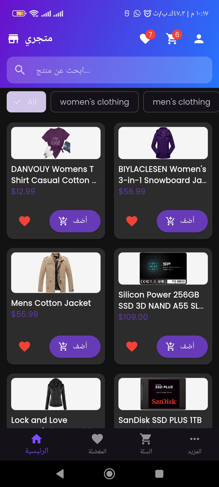
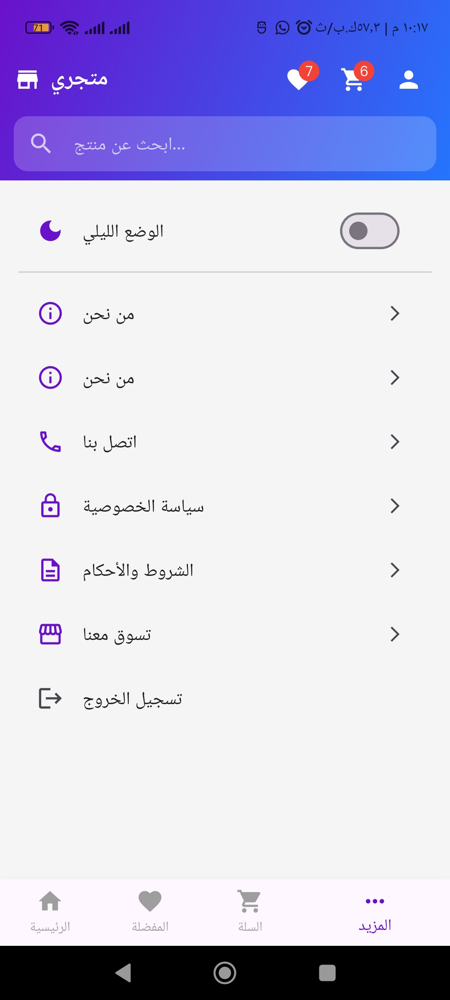
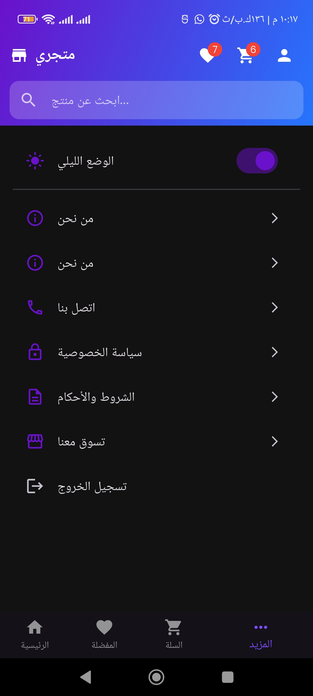

# 📘 Engineering Documentation – Additional Requirements: Offline Cart (SQLite) and Theme Persistence

This documentation continues the project development series and explains in detail how local cart storage using SQLite and theme persistence were implemented without affecting any existing functionality.

---

## 🎯 Objectives

1. **Offline Shopping Cart:**
   Enable the shopping cart to work completely offline using a local SQLite database while preserving the same behavior and user interface.

2. **Theme Persistence:**
   Add a dark mode option that users can enable, with the preference stored locally using SharedPreferences so it remains after app restarts.

---

### 📸 Screenshots

<p align="center">
  
  
  
  
</p>

## 🧱 Architectural Compliance

The same layered architecture was maintained:

```text
Service (Data) → Provider (State) → UI (Presentation)
```

* **Services Layer:** `CartDatabaseService` (SQLite), `ThemeService` (SharedPreferences)
* **Providers Layer:** Updated `CartProvider`, added `ThemeProvider`
* **UI Layer:** Updated `MoreScreen` to include a dark mode switch

---

## 📁 New Files

| File                                      | Description                                                                                                                                 |
| ----------------------------------------- | ------------------------------------------------------------------------------------------------------------------------------------------- |
| `lib/models/cart_item_local.dart`         | Local data model for the `cart_items` table with `fromMap`, `toMap`, and `copyWith`.                                                        |
| `lib/services/cart_database_service.dart` | SQLite database management service (singleton) with `addOrUpdateCartItem`, `getCartItems`, `updateQuantity`, `removeItem`, and `clearCart`. |
| `lib/services/theme_service.dart`         | Service for saving and retrieving theme preferences using `SharedPreferences`.                                                              |
| `lib/providers/theme_provider.dart`       | Theme state provider that wraps `ThemeService` and exposes `toggleTheme()` and `themeMode`.                                                 |

---

## 📝 Modified Files

### 1. `lib/models/cart_item_model.dart`

* Added the `toLocal()` method to convert a cart item into `CartItemLocal` (containing `productId`, `title`, `price`, `image`, and `quantity`) in preparation for SQLite storage.

### 2. `lib/providers/cart_provider.dart` (Major Refactor)

* Completely removed the `CartService` (REST API).
* The constructor now calls `_loadCartFromDatabase()` to load the saved cart from SQLite during app startup.
* The methods `addToCart`, `removeFromCart`, `incrementQuantity`, and `decrementQuantity` now operate directly on the local database while synchronizing the in-memory list.
* Added `clearCart()` to remove all cart items.
* All calculations (`subtotal`, `tax`, and `total`) remain unchanged.

### 3. `lib/main.dart`

* Added `ChangeNotifierProvider<ThemeProvider>` to `MultiProvider`.
* Wrapped `MaterialApp` with `Consumer<ThemeProvider>` to apply the dynamic `themeMode`.
* Updated `darkTheme` to use the new `AppTheme.darkTheme`.

### 4. `lib/screens/more_screen.dart`

* Added a `Switch` widget for toggling dark mode, connected to `ThemeProvider` and calling `toggleTheme()`.

### 5. `lib/theme/app_theme.dart`

* Added a complete dark theme (`darkTheme`) with consistent colors: dark backgrounds, dark cards, white text and icons, while preserving the same `appBarGradient`.

### 6. `pubspec.yaml`

* Added the `sqflite` and `path` packages for SQLite support, while ensuring `shared_preferences` remains included.

---

## 🗄️ Local Cart Storage Details

### Database Structure

A `cart_items` table was created with the following columns:

* `id` INTEGER PRIMARY KEY AUTOINCREMENT
* `productId` TEXT UNIQUE (Firestore product identifier)
* `title` TEXT
* `price` REAL
* `image` TEXT
* `quantity` INTEGER DEFAULT 1

---

### Singleton Pattern in `CartDatabaseService`

* The database is opened only once using `_internal` and `factory`.
* The table is created inside the `onCreate` callback during the first initialization.

---

### Add Logic (Conflict Resolution)

* The `addOrUpdateCartItem` method first checks whether a `productId` already exists.
* If it exists, the quantity is incremented.
* Otherwise, a new row is inserted.

This ensures that products are never duplicated while maintaining the correct quantity.

---

### Cart Loading During Startup

* `CartProvider` calls `_loadCartFromDatabase()` inside its constructor.
* This rebuilds the local cart state from SQLite and notifies listeners.

---

### Update and Delete Operations

* Quantity updates use `updateQuantity`, which automatically removes the row if the quantity reaches `0`.
* Direct deletion uses `removeItem` with the local database `id`.

---

## 🌓 Theme Persistence Details

### ThemeService

* Uses the `isDarkMode` key inside `SharedPreferences`.
* The default value is `false` (light mode).

---

### ThemeProvider

* Loads the saved preference during initialization.
* The `toggleTheme()` method switches the value, notifies listeners, and persists it.

---

### UI Integration

* In `MaterialApp`, `themeMode` from `ThemeProvider` is used to apply either `ThemeMode.light` or `ThemeMode.dark`.
* The toggle switch in `MoreScreen` is connected to `themeProvider.isDarkMode`.

---

### 🔓 Update: Guest Mode Support

**Objective:** Allow users to browse the application and explore products without requiring authentication, while keeping protected features (such as Favorites) restricted until the user signs in.

### Changes Implemented

* In `lib/main.dart`, the `AuthGate` widget was updated to always display `MainScreen` instead of redirecting unauthenticated users to `AuthScreen`.
* `AuthProvider` remains active and continues listening to authentication state changes.
* Users can sign in later through the user icon in `AppHeader` or when attempting to add a product to Favorites.

## ✨ Final Results

* **Offline Cart Support:**
  Cart data is stored locally and restored automatically after app restarts without requiring internet access or Firestore.

* **Persistent Theme Switching:**
  The user's dark mode preference remains saved even after closing the application.

* **No Existing Features Were Affected:**
  Authentication, products (Firestore), favorites, and search functionality continue to work as before.

* **Performance Preservation:**
  Continued use of `Selector` in the cart UI ensures optimal widget rebuild performance.

---
